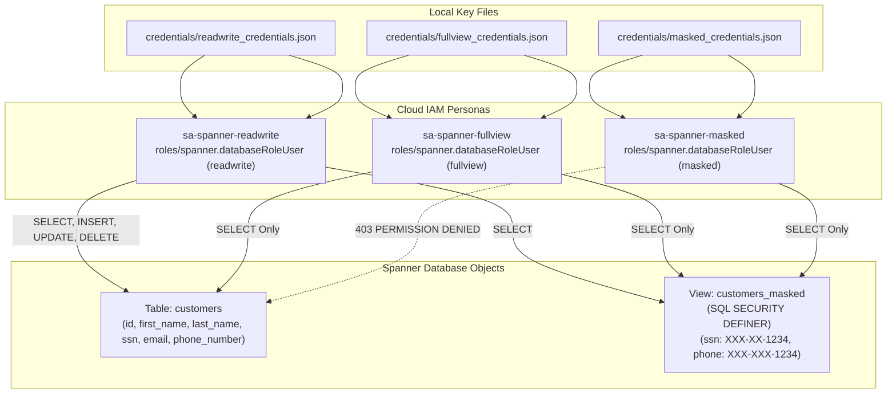

# Cloud Spanner Fine-Grained Access Control (FGAC) Demo

This repository demonstrates **Fine-Grained Access Control (FGAC)** in Google Cloud Spanner using Terraform, Python 3.11+ managed by `uv`, and an interactive `NiceGUI` dashboard.

---

## Architecture Overview



---

## Persona Security Matrix

| Persona | Local Credential File | Cloud IAM Role | Spanner DB Role | Table Access (`customers`) | View Access (`customers_masked`) | DML Operations |
| :--- | :--- | :--- | :--- | :--- | :--- | :--- |
| **1. ReadWrite** | `credentials/readwrite_credentials.json` | `roles/spanner.databaseRoleUser` | `readwrite` | **Allowed** (Unmasked) | **Allowed** (Masked) | **Allowed** (Insert, Update, Delete) |
| **2. FullView** | `credentials/fullview_credentials.json` | `roles/spanner.databaseRoleUser` | `fullview` | **Allowed** (Unmasked) | **Allowed** (Masked) | ❌ **Denied** (Read-Only) |
| **3. Masked** | `credentials/masked_credentials.json` | `roles/spanner.databaseRoleUser` | `masked` | ❌ **Denied** (403 Error) | **Allowed** (Masked SSN/Phone) | ❌ **Denied** (No DML) |

---

## Quickstart

### Prerequisites
- [Google Cloud SDK (`gcloud`)](https://cloud.google.com/sdk) authenticated: `gcloud auth application-default login`
- [Terraform](https://developer.hashicorp.com/terraform) (>= 1.5.0)
- [`uv`](https://github.com/astral-sh/uv) (Fast Python package manager)

---

### Step 1: Configure Terraform

1. Navigate to the `terraform/` directory:
   ```bash
   cd terraform
   ```
2. Create your `terraform.tfvars` from the example:
   ```bash
   cp terraform.tfvars.example terraform.tfvars
   ```
3. Edit `terraform.tfvars`:
   ```hcl
   project_id    = "your-gcp-project-id"
   region        = "us-central1"

   # Default is "shared-demos" (assumes it already exists).
   # If left empty ("") or null, Terraform will create a new Spanner instance with 100 PU, standard edition, and no backups.
   instance_name = "shared-demos"

   database_id   = "fgac-demo"
   ```

4. Apply the Terraform configuration:
   ```bash
   terraform init
   terraform apply
   cd ..
   ```

This creates:
- The Spanner database `fgac-demo`
- The `customers` table and `customers_masked` view (`SQL SECURITY DEFINER`)
- Database roles: `readwrite`, `fullview`, `masked`
- 3 FGAC Service Accounts and local JSON keys in `credentials/`:
  - `credentials/readwrite_credentials.json`
  - `credentials/fullview_credentials.json`
  - `credentials/masked_credentials.json`

---

### Step 2: Generate Synthetic Data & Seed Database

1. Generate 200 synthetic customer records with `Faker`:
   ```bash
   uv run scripts/generate_data.py
   ```
   *Generates `data/customers.csv` and `data/customers_masked.csv`.*

2. Seed the records into Spanner using the `readwrite` database role:
   ```bash
   uv run scripts/seed_database.py
   ```

---

### Step 3: Run Automated Verification Matrix

Run the automated test suite to verify the 3 FGAC personas against table queries, view queries, and DML:
```bash
uv run scripts/verify_access.py
```

Expected output:
```text
                   Spanner FGAC Security Verification Matrix                    
┏━━━━━━━━━━━━━━━━━━━━━━━━━━━━┳━━━━━━━┳━━━━━━━┳━━━━━━━━┳━━━━━━━┳━━━━━━━━┳━━━━━━━┓
┃                            ┃ Table ┃ View  ┃        ┃       ┃  Data  ┃       ┃
┃                            ┃ Query ┃ Query ┃  DML   ┃  DML  ┃ Sample ┃       ┃
┃ Persona                    ┃ (Unm… ┃ (Mas… ┃ Insert ┃ Dele… ┃ (SSN)  ┃ Stat… ┃
┡━━━━━━━━━━━━━━━━━━━━━━━━━━━━╇━━━━━━━╇━━━━━━━╇━━━━━━━━╇━━━━━━━╇━━━━━━━━╇━━━━━━━┩
│ 1. ReadWrite (FGAC Role)   │ ALLOW │ ALLOW │ ALLOW  │ ALLOW │ 650-3… │   ✓   │
│                            │       │       │        │       │        │ PASS  │
│ 2. FullView (FGAC Role)    │ ALLOW │ ALLOW │ DENIED │ DENI… │ 650-3… │   ✓   │
│                            │       │       │        │       │        │ PASS  │
│ 3. Masked (FGAC Role)      │ DENI… │ ALLOW │ DENIED │ DENI… │ XXX-X… │   ✓   │
│                            │       │       │        │       │        │ PASS  │
└────────────────────────────┴───────┴───────┴────────┴───────┴────────┴───────┘

All FGAC security boundaries verified successfully!
```

---

### Step 4: Launch Interactive Demo Dashboard (NiceGUI)

Launch the web application to demonstrate persona switching, live queries, and schema DDL:
```bash
uv run app/app.py
```
- **Tab 1 ("Security & Access Demo")**: Interactive persona switcher (`readwrite`, `fullview`, `masked`), live query executions against the table vs. masked view, DML insert tests, and real-time security error audits.
- **Tab 2 ("Database DDL & Schema")**: Visual breakdown of the `customers` table, the `SQL SECURITY DEFINER` masked view, role privileges, and a live Spanner DDL viewer with a refresh button.
- **Tab 3 ("Python Connection & Role Usage")**: Explains the two-tier security model (IAM authentication vs FGAC authorization), demonstrates why passing `database_role` to the Python SDK is necessary, and provides a live 3-button test playground comparing valid, omitted, and unauthorized role requests in real time.
